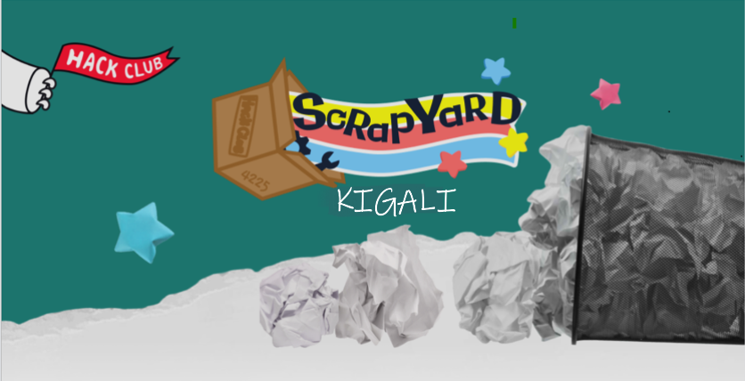

# Build stupid s#!t, get stupid prizes.

Scrapyard is a global hackathon running in Los Angeles and 100+ other cities by high schoolers (like Counterspell) with a “scrappy” theme of stupid inventions! It’s organized by Hack Club, a 501(c)(3) nonprofit that supports a global community of 48k high school makers.

Powered by [Hack Club](https://hackclub.com), a nonprofit supporting over 48,000 high school makers globally, Scrapyard Kigali brings together young innovators to think outside the box, build exciting solutions, and have fun!

---

**Developed by [Hack Club] (https://hackclub.com) with contributions from ♡ shyakachaste** 🎉
